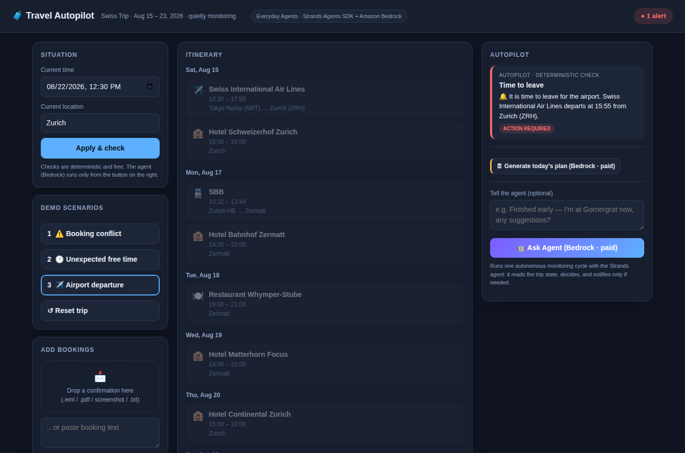
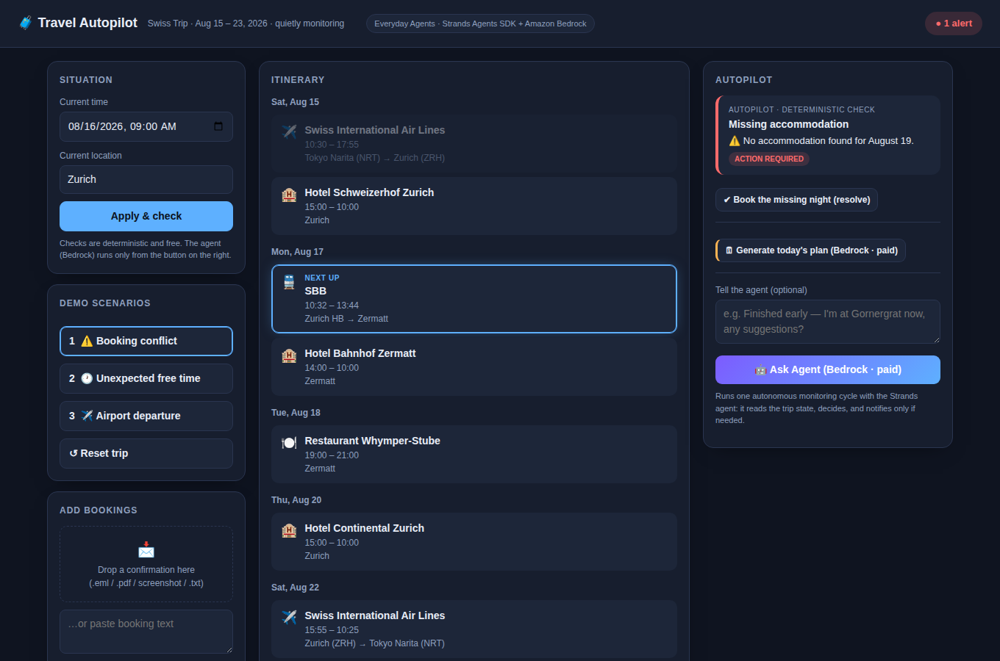
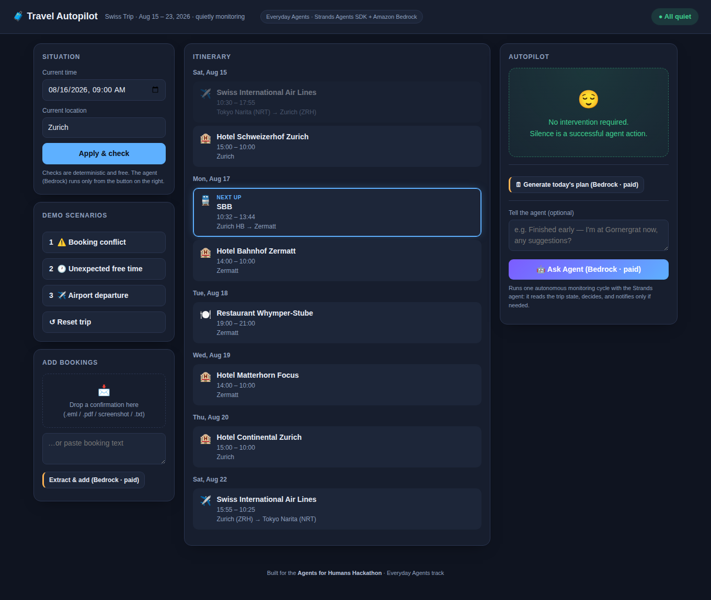

# 🧳 Travel Autopilot

[](https://github.com/zooken2000/travel-autopilot/actions/workflows/ci.yml) [](https://github.com/zooken2000/travel-autopilot/blob/main/LICENSE)

**An autonomous AI agent — built with the Strands Agents SDK on Amazon Bedrock — that quietly manages your trip and intervenes only when you need to decide.**

Built for the **Agents for Humans Hackathon** — Track: *Everyday Agents*.

> The Everyday Agents brief puts it best: *"the best ones run quietly in the
> background and only ping you when there's a real decision to make."* Travel
> Autopilot applies that idea to one of the most decision-dense parts of daily
> life: being on a trip.

## The problem

Travelers make dozens of small decisions during a trip: *What train next? Where do I transfer? What's today's plan? What should I do with unexpected free time? When should I leave for the airport?*

Traditional travel assistants are reactive — you must ask. Travel Autopilot is **proactive**: it understands the itinerary and the current situation, fetches fresh information from the web only when needed, and notifies the traveler **only when intervention is truly required**.

> Search and reason autonomously. Interrupt humans only when necessary.


*The agent notices it is time to leave for the airport — without being asked.*

| Booking conflict detected | Confirmation dropped in, conflict resolved |
|---|---|
|  |  |

## How it works

```
Trip State → Agent monitors → Agent decides → fetch only needed info
    → problem? → YES: notify / NO: stay silent
```

Silence is a successful agent action.

- **LLM (Strands Agents SDK + Amazon Bedrock)** handles: understanding unstructured booking text, ambiguous reasoning, deciding when web search is needed, tool selection.
- **Deterministic Python** handles: datetime math, schedule-overlap detection, accommodation-gap detection, notification thresholds.

See [docs/ARCHITECTURE.md](docs/ARCHITECTURE.md) for the architecture diagram.

## Project layout

```
app/
  models/     Pydantic models (BookingRecord, TripState, Alert)
  services/   Deterministic business logic (monitoring, consistency, decisions)
  storage/    TripState persistence
  agent/      Strands agent, tools, system prompt
tests/        Unit tests (no LLM calls required)
data/         Demo trip data
scripts/      Demo runner
```

## Try it in 2 minutes (no AWS account needed)

The entire business logic — conflict detection, free-time recognition,
departure alerts — is deterministic and runs without any AWS setup:

```bash
python3 -m venv .venv && source .venv/bin/activate
pip install -e ".[dev]"
pytest                      # 53 tests, zero LLM calls
python scripts/run_demo.py  # all three scenarios through real logic
uvicorn app.main:app        # the web UI; every check is free
```

AWS credentials (below) are only needed for the agent itself: the
"Ask Agent" button, booking extraction, plan generation, and the
AgentCore deployment.

## Setup

Requirements: Python 3.10+ and (for live agent runs) AWS credentials with Amazon Bedrock model access.

```bash
python3 -m venv .venv && source .venv/bin/activate
pip install -e ".[dev]"

# Configure AWS credentials for Bedrock (any standard method works)
cp .env.example .env   # then fill in values, or use `aws configure`
```

## Run the tests

```bash
pytest
```

All business logic is testable without any LLM calls.

## Run the web UI

```bash
uvicorn app.main:app --reload
# open http://127.0.0.1:8000
```

The UI shows the itinerary timeline, the current situation, and the Autopilot
panel. All checks in the UI are deterministic and free; the "Ask Agent" button
is the only action that calls Amazon Bedrock. Type a message first (e.g. "Finished early — I'm at Gornergrat, any suggestions?") and the agent updates the trip state and answers; leave it empty for an autonomous monitoring cycle.

## Run the demo scenarios

```bash
python scripts/run_demo.py            # all three scenarios
python scripts/run_demo.py conflict   # 1: booking conflict (missing hotel night)
python scripts/run_demo.py freetime   # 2: unexpected free time in Zermatt
python scripts/run_demo.py airport    # 3: airport departure alert
```

The scenarios run through the real business logic — no hardcoded demo outputs.

## Tech

- [Strands Agents SDK](https://strandsagents.com/) — agent loop and tools
- Amazon Bedrock — Claude model for reasoning and booking extraction
- Pydantic — typed trip state

## License

MIT — see [LICENSE](LICENSE).
