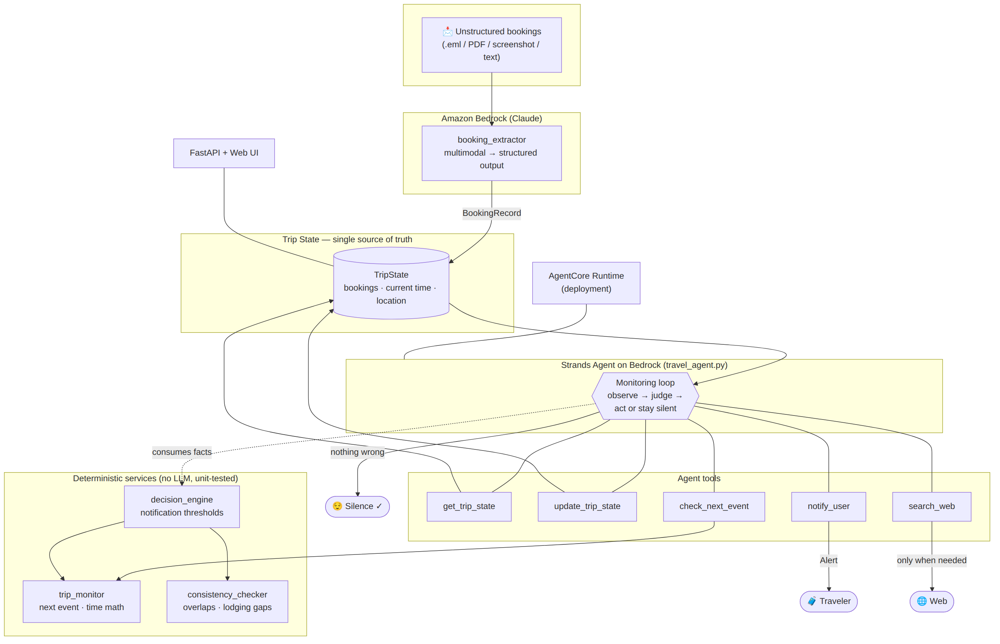
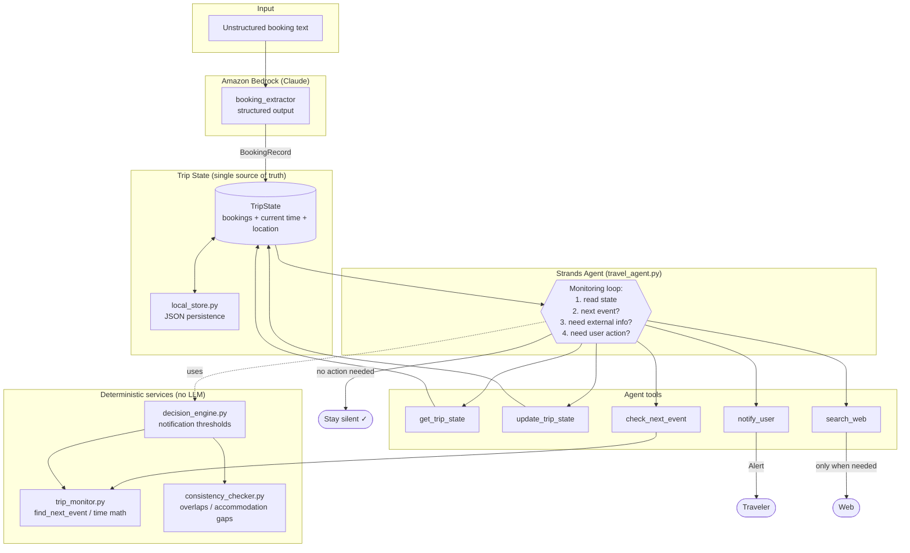

# Travel Autopilot — Architecture

## Overview

Travel Autopilot separates responsibilities strictly:

- **The agent (LLM)** decides *whether* and *when* to act: does the next event need fresh external information? Does the traveler need to be interrupted?
- **Deterministic Python** computes *facts*: time until events, schedule overlaps, accommodation gaps, notification thresholds. No LLM is ever used for arithmetic.

## Diagram



<details><summary>Mermaid source</summary>



</details>

## Core loop

```python
trip_state = get_trip_state()
next_event = find_next_event(trip_state)

if needs_external_information(next_event):
    information = search_web()

decision = evaluate(trip_state, next_event, information)

if decision.requires_user_attention:
    notify_user(decision)
else:
    remain_silent()
```

## Components

| Component | Kind | Responsibility |
|---|---|---|
| `app/models/` | Pydantic | `BookingRecord`, `TripState`, `Alert` — typed contracts between all layers |
| `app/services/trip_monitor.py` | Deterministic | Next event, time-until-event, free-time detection |
| `app/services/consistency_checker.py` | Deterministic | Schedule overlaps, accommodation-gap nights |
| `app/services/decision_engine.py` | Deterministic | Converts facts into `Alert`s using fixed thresholds |
| `app/services/booking_extractor.py` | LLM (Bedrock) | Unstructured booking text → validated `BookingRecord` |
| `app/agent/travel_agent.py` | LLM (Strands) | The autonomous agent: monitoring, tool selection, silence-vs-notify |
| `app/storage/local_store.py` | Deterministic | TripState JSON persistence |

## Design principles

1. **Trip State is the single source of truth.** The agent reads it on every decision. Itinerary changes update it; outdated plans are never kept active.
2. **Silence is a successful outcome.** The decision engine returns no alerts when nothing needs attention, and the agent is instructed not to invent notifications.
3. **Web search is a tool, not the product.** The agent calls it only when current external information is required.
4. **Business logic is testable without an LLM.** All threshold and datetime logic lives in pure functions with unit tests.
